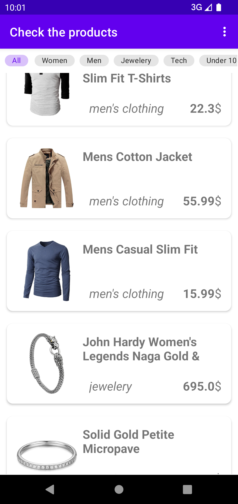

# TestProject

Project created in MVVM architecture in XML/fragments, following the clean architecture for LBG.

Created using Dependency Injection (Dagger/Hilt), Coroutines, Glide (Images), encrypted Room local storage (also used for filters as the API does not allow it).

Tested using Espresso, Jacoco, JUnit and Mockito as well as tested for memory leaks with LeakCanary.

